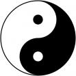

### JS原型链整理

在JS中，对象分为两大类，object和function，object是普通对象，function是函数对象。

使用new Function创建的都是函数对象，以下几种形式都相当于创建了函数对象：

> function f1(){....}
>
> var f2 = function () {...}
>
> f3 = new Function('a', 'b', 'return a*b');
>
> console.log(typeof f1, typeof f2, typeof f3);  //function  function  function

但是以下形式创建的是Object对象：

> var ob = new Object();
>
> var jn = {
>
> &emsp;&emsp;&emsp;&emsp;name : 'Wert'
>
> };
>
>
>
> function fn(x) {
>
> &emsp;&emsp;&emsp;&emsp;return x*x*x;
>
> }
>
> var f = new fn();
>
> console.log(typeof ob, typeof jn, typeof f); //object object object

只要不是通过Function创建的就是普通对象。prototype属性是不能自己访问的。原型链一定要有一个长度限制，当递归调用GetPrototypeOf方法一定会以null值终止（相当于连续的\_\_proto\_\_.\_\_proto\_\_····），null类型是object，但是null没有原型。

var mul = new Function('a', 'b', 'return a * b');

console.log(

&emsp;&emsp;&emsp;&emsp;mul.\_\_proto\_\_ === Function.prototype,  //true

&emsp;&emsp;&emsp;&emsp;mul.\_\_proto\_\_.\_\_proto\_\_.\_\_proto\_\_     //null

);

mul.\_\_proto\_\_.\_\_proto\_\_相当于Function.protoype.\_\_proto\_\_指向的是Object.prototype。

Object.prototype.\_\_proto\_\_指向的是null。

**但是一个有趣的问题是：Function.\_\_proto\_\_一定是要指向Function.prototype的，Function只能由Function创建。Object是通过Function创建的，但是Function.\_\_proto\_\_.\_\_proto\_\_却指向Object.prototype，而Object.\_\_proto\_\_指向Function.prototype。这看起来很乱，就像是鸡生蛋，蛋生鸡的情况，循环相生。**

- 所有的对象都有\_\_proto\_\_属性，只有函数对象有prototype属性。
- 函数对象的prototype属性是用于继承的，给自己的后代，自己无法访问。
- 每个对象的\_\_proto\_\_指向其父类对象的prototype。
- 原型链查找是按照\_\_proto\_\_查找，直至null结束。
- Object是通过Function创建的，类型是function。
- Function.prototype的类型是function，其他函数对象的prototype类型都是object。
- Function.\_\_proto\_\_指向的是Function.prototype，类型是function。
- Object由Function创建，所以Object.\_\_proto\_\_指向Function.prototype，类型是function。
- Function.\_\_proto\_\_ === Function.prototype
- Function.\_\_proto\_\_.\_\_proto\_\_ === Object.prototype
- Object.prototype.__proto == null

到目前为止，我还无法搞清楚底层实现的原理，对于C++不是很了解，以C语言的功底来猜测，肯定是根据语言规范使用指针相互指向，最终会指向一个标记类型为null的结构。从我目前的探索考虑，我对原型链及其背后设计思想的理解可以用下图来表明：

阴中有阳，阳中有阴，既相生也相克。对于这个图，请不要把它看成是二维的，这个图在描述时是立体呈现的，只不过画成了二维的。事实上，如果你深入研究，这个图揭示的简洁哲学原理可以描述一切，当你去分解那些复杂的事物，你会发现很多东西不是我们刻意去遵循某个原理，而是当我们找到一个好的方法或设计，就会发现其方法自然地遵循这种哲学。

#### 构造函数

只有函数对象才可以用new关键字，使用new关键字会创建一个新的对象。但是只有函数对象才可以用new。

>function Fy(name, role, skill) {
>
>&emsp;&emsp;this.name = name;
>
>&emsp;&emsp;this.role = role;
>
>&emsp;&emsp;this.skill = skill;
>
>&emsp;&emsp;this.getSkill = function() {
>
>&emsp;&emsp;&emsp;&emsp;return this.skill;
>
>&emsp;&emsp;};
>
>&emsp;&emsp;this.getName = function() {
>
>&emsp;&emsp;&emsp;&emsp;return this.name;
>
>&emsp;&emsp;};
>
>}
>
>var  f =  new Fy('Albert', 'master', 'fast-run,voilent-fighting');
>
>console.log(f.getSkill());   //fast-run,voilent-fighting
>
>
>
>new Fy操作创建了一个对象并让f引用，f是Fy的实例， 类型是object。而Fy就是f的构造函数。

所有的对象都会从原型继承一个constructor属性，一个constructor必须是一个函数对象，所以子对象继承后的constructor一定要指向一个函数对象。在上面示例中，f.constructor指向Fy。

